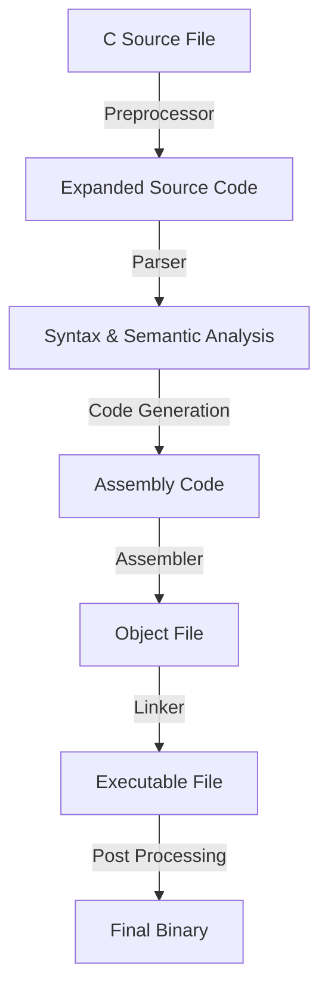

# Embedded Project Build Process

In embedded systems development, the build process consists of several stages that convert human-readable source code into a machine-executable binary. This process ensures that the code is optimized and correctly formatted for the target microcontroller or processor.

## Build Process Stages

The embedded project build process consists of the following key stages:

1. **Preprocessing**
2. **Parsing**
3. **Producing Object Files**
4. **Linking Object Files**
5. **Producing the Final Executable**
6. **Post-Processing of Final Executable**

---

## **Compilation Stages with Detailed Explanation**



### **1. Preprocessing**
- The preprocessor handles directives like `#include`, `#define`, and `#ifdef`.
- It expands macros, replaces header files, and removes comments.
- Command Example:
  ```sh
  arm-none-eabi-gcc -E main.c -o main.i
  ```

### **2. Parsing & Semantic Analysis**
- The compiler checks syntax and semantics.
- Ensures variable types and function calls are valid.
- Converts the code into an intermediate representation (IR).

### **3. Code Generation**
- The compiler generates assembly code from IR.
- Example output:
  ```assembly
  MOV R0, #5
  ADD R1, R0, #10
  ```

### **4. Assembling (Converting Mnemonics to Machine Code)**
- The assembler converts assembly code into machine code.
- Produces an object file (`.o`).
- Example command:
  ```sh
  arm-none-eabi-as -o main.o main.s
  ```

### **5. Linking Object Files**
- Links multiple object files to create the final executable.
- Resolves function references and memory allocation.
- Example command:
  ```sh
  arm-none-eabi-ld -o final.elf main.o
  ```

### **6. Post-Processing of Final Executable**
- Converts ELF to a binary format (`.bin` or `.hex`).
- Used for flashing onto microcontrollers.
- Example command:
  ```sh
  arm-none-eabi-objcopy -O binary final.elf final.bin
  ```

---

## **Compiler Settings on STM32 CubeIDE**
To configure the compiler settings for an STM32 project:

1. Open **STM32CubeIDE**.
2. Go to **Project Properties → C/C++ Build → Settings**.
3. Under **MCU GCC Compiler**, set:
   - Optimization Level: `-O2` or `-Os` (for smaller binaries).
   - Debug Level: `-g3` (for full debugging support).
4. Under **MCU GCC Linker**, ensure the linker script (`.ld`) is correctly configured.

---

## **Conclusion**
Understanding the embedded build process is crucial for debugging and optimization. Each step ensures that the code is efficiently converted into machine instructions suitable for microcontrollers. 🚀
