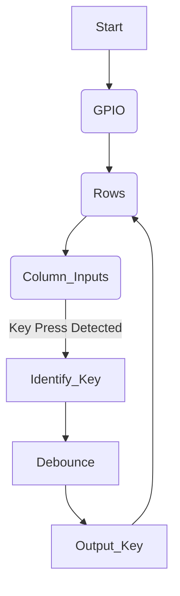

# Keypad Interfacing in Embedded Systems Programming

## Introduction
A **keypad** is a matrix of switches arranged in rows and columns, typically used for user input in embedded systems. By scanning the rows and columns, we can determine which key has been pressed.

## 1. How a Keypad Works
A **4x4 keypad** consists of:
- **4 Rows** (R0, R1, R2, R3)
- **4 Columns** (C0, C1, C2, C3)

Each key is positioned at the intersection of a row and column. The microcontroller applies a logic signal to the rows and reads the status of the columns to detect key presses.

### Keypad Circuit Representation:
```
R0 ---+---[Key]--- C0
R1 ---+---[Key]--- C1
R2 ---+---[Key]--- C2
R3 ---+---[Key]--- C3
```

## 2. Detecting Key Press Events
Key press detection is done by scanning the keypad:
1. Set **one row LOW** at a time while keeping others HIGH.
2. Read the column inputs.
3. If a column is LOW, a key in that row is pressed.
4. Identify the pressed key based on the row-column combination.
5. Debounce to avoid multiple detections due to mechanical contact bouncing.

## 3. Keypad Implementation Flow Chart


## 4. Keypad Key Read Code Implementation (C Code Example)
```c
#include <stdint.h>
#define ROWS 4
#define COLS 4

const char keypad[ROWS][COLS] = {
    {'1', '2', '3', 'A'},
    {'4', '5', '6', 'B'},
    {'7', '8', '9', 'C'},
    {'*', '0', '#', 'D'}
};

void scanKeypad(void) {
    for (int row = 0; row < ROWS; row++) {
        setRowLow(row);  // Set one row LOW
        for (int col = 0; col < COLS; col++) {
            if (readColumn(col) == 0) {
                char keyPressed = keypad[row][col];
                debounce();  // Debounce to prevent false detections
                return keyPressed;
            }
        }
        setRowHigh(row);  // Reset the row HIGH
    }
    return '\0';  // No key pressed
}
```

## 5. Delay Analysis in Keypad Scanning
### **Why Delay is Needed?**
- When a key is pressed, mechanical bouncing causes rapid transitions between HIGH and LOW states.
- To prevent multiple detections, we introduce a **debounce delay** (typically 5-20ms).

### **Software Delay Implementation**
```c
void debounce(void) {
    for (volatile int i = 0; i < 10000; i++);  // Simple delay loop
}
```

### **Hardware Delay Alternative**
- Use **external capacitors** for hardware debouncing.
- Implement **timer-based delay** for better accuracy instead of software loops.

## Conclusion
- Keypad interfacing is crucial in embedded systems for user input.
- We scan rows and read columns to detect key presses.
- A **debounce mechanism** ensures reliable input.
- **Delays** (software/hardware) prevent multiple detections due to bouncing.

